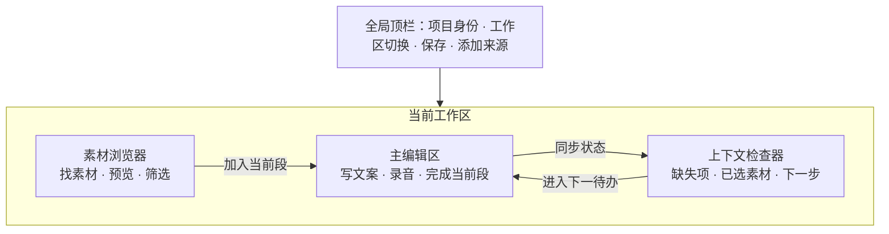

# MangaDesk 产品布局优化方案

> 文档类型：单屏工作区 UX / UI 优化建议 
> 审计对象：当前“漫画工作区”主界面 
> 审计依据：用户提供的 3000 × 1880 界面截图，以及现有 `WorkspacePage`、`AppHeader`、`MangaBrowser`、`BlockEditor`、`BlockStatusPanel` 结构 
> 核心目标：在不减少专业能力的前提下，让界面更舒展、主任务更明确、操作更连贯，并避免为了“留白”而显得臃肿

## 1. 结论先行

当前界面的问题不是单纯“间距小”，而是**全局操作、当前任务、过程状态同时抢占第一视觉层级**：顶部十余个入口权重接近；左侧预览、缩略图和卡片操作同时出现；右侧把状态、排序、待办、素材篮、撤销重做全部堆叠展示。结果是控件很多、边界很多、强调色很多，但用户进入页面后仍需判断“现在最应该做什么”。

推荐采用以下布局原则：

**三栏框架保留，职责重新分配；顶部只放全局动作，中央只服务当前段落，左右面板按需展开。**

- 左栏是“找素材”：浏览、预览、筛选、加入当前段。
- 中栏是“做内容”：写文案、录音、完成当前段。
- 右栏是“看结果”：当前段状态、已选素材、下一步；支持折叠。
- 顶栏是“管项目”：项目身份、视图切换、保存、导入/添加来源，其余操作收进菜单。
- 同一时刻只保留一个橙色主行动按钮，降低视觉噪声。

这不是把界面做得更“空”，而是让高频操作更近、低频操作更隐、信息之间有清楚的呼吸区。

## 2. 用户核心任务

用户在该页面中的主线不是“管理所有功能”，而是循环完成一段内容：

1. 找到合适的漫画画面。
2. 编写或调整当前段文案。
3. 将画面加入当前段。
4. 在真人旁白模式下完成录音。
5. 确认当前段并进入下一项待办。

布局应让用户始终知道三件事：**我正在处理哪一段、这一段还缺什么、下一步去哪。**

## 3. 当前界面审计

### 3.1 值得保留的基础

- 三栏分别承载素材、编辑、状态，业务分区方向正确，不需要推翻重做。
- 深色主题适合长时间进行内容生产，橙色品牌色也具备较强识别度。
- 选中素材、当前 Block、录音区域已经有明确边框反馈。
- 主流程能力在一个页面内闭环，避免频繁切换窗口。
- 面板标题、搜索、完成按钮等基础入口位置总体符合桌面工具习惯。

### 3.2 核心问题与影响

| 优先级 | 问题 | 截图中的表现 | 对用户的影响 |
| --- | --- | --- | --- |
| P0 | 顶部操作没有主次 | 项目、Storyboard、导出、剪映辅助、保存、添加来源、导入 PDF、导入目录同排展示 | 首屏像“功能清单”，用户无法快速找到当前工作所需操作；较窄窗口容易挤压或换行 |
| P0 | 右栏职责过多 | 状态、排序、复制删除、下一待办、素材篮、撤销重做纵向堆叠 | 重要的“已选素材”和“还缺什么”被大量管理动作包围 |
| P0 | 视觉层级过于平均 | 大量卡片、描边、按钮使用相近亮度和尺寸 | 用户需要逐块阅读，而不能一眼锁定主任务 |
| P1 | 左侧素材卡片操作重复 | 每张缩略图常驻收藏、暂存、加入等操作，顶部预览区也重复出现 | 缩略图空间被压缩，画面识别效率下降，列表显得拥挤 |
| P1 | 中央编辑上下失衡 | 当前 Block 内部控件紧密堆叠，但下方画布存在大面积空白 | 局部感觉拥挤、整体又显空，空间没有用于帮助连续创作 |
| P1 | 多个橙色按钮争夺注意力 | 新增段落、完成并新建、开始录音、导入目录等同时强调 | 主行动不唯一，强调色失去“下一步”的含义 |
| P1 | 低对比度小字较多 | 辅助说明、计数、状态文字多为偏暗灰色且字号较小 | 长时间使用容易疲劳；在高分屏、缩放或视力较弱时更明显 |
| P2 | 隐性操作学习成本高 | “双击段落展开 / 收起”、快捷键拆分等依赖说明文字 | 用户需要记忆操作，触控板或非熟练用户不易发现 |

### 3.3 单屏流程健康度

| 步骤 | 用户看到与执行的动作 | 当前健康度 | 判断 |
| --- | --- | --- | --- |
| 1 | 进入项目并判断当前工作模式 | 一般 | 项目信息可见，但顶栏入口过多，模式与全局动作混在一起 |
| 2 | 在左栏搜索、预览并选择素材 | 一般 | 功能完整，但卡片操作密、缩略图偏小，查看与加入动作重复 |
| 3 | 在中央编写当前段文案 | 较好 | 编辑器位于视觉中心，但段落操作和录音区域同时展开，主次不足 |
| 4 | 加入素材或完成录音 | 一般 | 操作可达，但左右来回确认，且多个强调按钮竞争注意力 |
| 5 | 确认完成并前往下一待办 | 较弱 | “完成并新建”和右栏“下一待办”是两套推进方式，流程出口不统一 |

## 4. 推荐的信息架构

信息层级按以下顺序建立：

1. **一级：当前段落与主行动**——中央编辑区始终最醒目。
2. **二级：素材与完成情况**——左右栏支持当前任务，但不与主编辑区竞争。
3. **三级：项目管理与低频工具**——放入顶栏菜单或更多操作，不长期占据首屏。

## 5. 推荐布局规格

### 5.1 整体尺寸

在 1440px 及以上宽度使用三栏：

| 区域 | 推荐默认值 | 可调整范围 | 说明 |
| --- | ---: | ---: | --- |
| 全局顶栏 | 56px 高 | 固定 | 保持单行，不承载所有功能 |
| 左侧素材栏 | 320px 宽 | 280–400px | 支持拖拽调整，记住上次宽度 |
| 中央编辑区 | 自适应 | 最小 640px | 永远优先获得剩余空间 |
| 右侧检查器 | 304px 宽 | 280–360px | 可折叠，折叠后保留带状态点的入口 |
| 面板内容边距 | 20–24px | — | 卡片内部 16px；组间距 20–24px |

现有 `28% / 50% / 22%` 百分比分栏会随窗口同步缩放，容易造成左栏过宽、中央区不足或右栏浪费。建议改为**左右固定可调、中间弹性填充**。

### 5.2 响应式策略

| 窗口宽度 | 布局策略 |
| --- | --- |
| ≥ 1440px | 三栏常驻，右栏可折叠 |
| 1180–1439px | 左栏 288px，中央自适应；右栏默认折叠为抽屉 |
| 960–1179px | 中央编辑区常驻；素材与状态通过左右抽屉打开 |
| < 960px | 明确提示进入紧凑模式；使用“素材 / 编辑 / 状态”分段切换，不强行压缩三栏 |

切换布局时应保留当前段、滚动位置、选中素材和未提交文案，避免界面缩放导致任务上下文丢失。

## 6. 分区域改造建议

### 6.1 全局顶栏：从“按钮仓库”变为项目导航

推荐结构：

- 左侧：品牌、项目名、保存状态。保存状态使用“已保存 / 保存中 / 保存失败”文字与状态点，不单独占用按钮。
- 中部：`工作区`、`Storyboard`、`导出` 三个一级视图切换。
- 右侧：`保存`、主按钮 `添加来源`、`更多`。
- `添加来源` 使用下拉菜单统一“漫画目录、PDF、视频”等入口。
- `更多` 收纳项目中心、剪映辅助及后续低频工具。
- “旁白模式”和“漫画/动漫工作区”是当前编辑上下文，移到中央区或素材栏的局部标题栏，不再与全局功能混排。

原则：顶栏最多保留 **1 个橙色主按钮 + 2～3 个常用入口**。只有当前视图和不可忽略的错误状态需要持续高亮。

### 6.2 左栏：优先展示内容，而不是每张卡片的所有操作

推荐将左栏拆成三层：

1. 顶部工具区：标题、全部/收藏筛选、搜索；筛选可合并为一个紧凑分段控件。
2. 当前预览：默认高度 200–220px，可一键收起；操作仅保留“加入当前段”和“打开大图”。
3. 素材网格：默认两列，保证漫画画面可辨认；栏宽增大时可自动三列。

卡片优化：

- 常态只显示缩略图、页码、使用次数或已加入状态。
- 收藏、暂存等次级动作在悬停或选中时出现。
- 选中卡片只使用一条橙色边框和轻微底色，不叠加多个醒目标识。
- “点击选中、双击加入”不能作为唯一方式；选中后显示清楚的 `加入当前段` 按钮，并保留快捷键作为效率增强。
- 批量选材是后续能力，不应在第一轮改造中加入新的常驻工具条。

### 6.3 中央区：建立明确的“当前段落工作台”

中央区建议保持最大阅读宽度 760–840px，并在大屏上居中，避免文本行过长。它应包含：

- 局部标题栏：`当前段 #001 / 12`、段落搜索、导入文稿、新增段落。
- 段落列表：非当前段折叠为 52–60px 高的摘要行；当前段自动展开。
- 文案编辑：文本区域保持足够高度和 1.6–1.8 行高，字数与快捷键提示降为辅助层。
- 录音模块：仅在真人旁白模式显示；默认展示摘要状态，首次录音或正在录音时自动展开。
- 底部行动区：固定在当前段卡片底部，主按钮统一为 `完成当前段`；旁边下拉提供“完成并新建”“完成并前往下一待办”。

调整后，拆分、合并、复制、删除等编辑动作放进段落标题的 `···` 菜单；高频快捷键继续保留，但不依赖说明文字才能发现功能。

### 6.4 右栏：从“管理面板”变为当前段检查器

右栏只回答两个问题：**这一段缺什么？已经选了什么？**

建议顺序：

1. 当前段摘要：编号、完成度、缺失项。
2. 五项状态：改为单行或两行的状态标签；可手动更改的项目有明确交互，自动计算的“录音”使用只读状态，避免禁用复选框造成困惑。
3. 已选素材：成为右栏主体，显示缩略图、顺序、定位和移除。
4. 暂存篮：折叠区或与“已选素材”并列的页签，名称和数量常驻可见。
5. 底部固定 `前往下一待办`，点击后默认进入最接近当前段的缺失项；旁边可选择文案、配图、录音。

移动、复制、删除收进当前段的更多菜单；撤销/重做放入底部状态栏或依赖系统快捷键，仅在发生操作后短暂显示提示。这样右栏不再由多张同权重卡片堆叠而成。

## 7. 视觉与组件规则

### 7.1 颜色层级

- 页面底色：最深，用于拉开工作区边界。
- 左右面板：比页面底色亮一级。
- 当前段卡片：再亮一级；普通折叠段落不使用厚重卡片背景。
- 边框：默认低对比度，仅在选中、聚焦、拖拽目标时增强。
- 橙色：只用于主行动、当前选中和关键进度，不用于多个并列按钮。
- 录音状态：使用独立的红色语义色，仅在录音相关区域出现。

建议继续沿用现有深色与橙色品牌体系，不引入渐变、玻璃拟态或大面积投影，以免增加视觉负担。

### 7.2 间距与圆角

采用 4px 基础单位，常用间距限定为 4 / 8 / 12 / 16 / 24 / 32px：

- 图标与文字：8px。
- 同组控件：8–12px。
- 卡片内部：16px。
- 内容组之间：20–24px。
- 面板外边距：20–24px。
- 常规控件圆角：6–8px；大卡片：10–12px。

减少“每一块都套卡片”的做法。优先用间距、标题和一条分隔线建立层级，卡片只包裹需要形成操作上下文的内容。

### 7.3 字体与按钮

- 页面/面板标题：16px，600 字重。
- 当前段编号等关键数据：18–20px，600–700 字重。
- 正文与按钮：14px。
- 辅助信息：12–13px，不建议继续使用 11px 作为重要信息字号。
- 主按钮高度：40px；常规按钮和图标点击区域建议不小于 36–40px。
- 图标按钮必须提供可见提示或悬停说明；危险操作保持红色，但不与主按钮同权重。

## 8. 关键交互原则

### 8.1 一个阶段，一个主行动

- 正在写文案：主行动是 `完成当前段`。
- 正在选择画面：左栏选中素材后，主行动是 `加入当前段`。
- 正在录音：录音区只突出 `开始录音 / 停止录音`。
- 导入来源属于项目级动作，只在顶栏突出。

主行动的位置保持稳定，不要根据状态在页面不同位置跳动；状态可以改变按钮文案或可用性，但不改变用户的空间记忆。

### 8.2 渐进展开

- 不常用动作放入 `···`，但完成、加入、录音等核心动作始终可见。
- 录音详情、暂存篮、段落批量操作只在需要时展开。
- 折叠状态必须显示摘要，例如“已录 1 条 · 12.4 秒”，避免用户为确认状态反复展开。

### 8.3 状态反馈

- 加入素材后，在缩略图上即时显示“已加入 #001”，右栏同步新增条目。
- 完成当前段后给出轻量提示，并将焦点移动到下一待办；允许撤销。
- 保存失败要在顶栏持续可见，并提供重试；“已保存”只做低强调反馈。
- 抽屉或面板折叠时，用数量徽标提示未完成项和已选素材数。

## 9. 可访问性风险与验证边界

从截图可见的风险：

- 多处辅助文字偏小且与背景对比弱，需要提高字号或亮度。
- 部分图标按钮依赖图形含义，需确保有明确标签或悬停提示。
- 禁用状态、未完成状态和普通次级状态较接近，不能只依赖颜色区分。
- 控件密集时点击目标之间间隔较小，容易误触。
- 三栏固定比例在放大或较窄窗口下可能产生内容挤压。

仅凭截图无法确认键盘焦点顺序、焦点可见性、屏幕阅读器名称、实际颜色对比值、200% 缩放重排、拖拽的键盘替代方案。实施后需要通过真实应用逐项验证，不能据此声称已满足完整无障碍标准。

## 10. 分阶段落地计划

### 第一阶段：先解决结构问题（P0）

- 顶栏合并导入入口，低频动作进入更多菜单。
- 分栏改为左右固定可调、中间弹性填充。
- 右栏移除排序、复制删除、撤销重做的常驻展示。
- 统一橙色主按钮规则。
- 将右栏改为“缺失项 + 已选素材 + 下一待办”。

预期收益：不改变主要业务逻辑即可明显降低首屏噪声，用户更快定位当前任务。

### 第二阶段：优化高频工作流（P1）

- 左栏缩略图改为内容优先，次级动作按需出现。
- 当前段操作区固定，统一“完成后去哪里”的流程。
- 录音模块支持摘要与展开。
- 放大辅助文字并统一间距、按钮高度、卡片层级。

预期收益：减少左右视线跳转和重复点击，提高连续制作效率。

### 第三阶段：完善适配与效率（P2）

- 增加面板折叠、拖拽调宽与宽度记忆。
- 补齐 1180px 以下的抽屉模式和放大重排。
- 优化键盘操作、焦点管理和状态播报。
- 根据真实使用数据决定是否提供“舒适 / 紧凑”密度切换，默认使用舒适模式。

## 11. 验收标准

### 布局验收

- 1440px 宽窗口下顶栏保持单行，中央编辑区宽度不低于 640px。
- 左右栏均可折叠；折叠和恢复不丢失滚动位置、选中素材与当前段。
- 1180px 以下不出现按钮重叠、文本被强制压成竖排或横向页面滚动。
- 当前段展开时，其主按钮在无需寻找的情况下可见。

### 体验验收

- 新用户进入工作区后，能够在 5 秒内指出当前段、缺失项和主行动。
- 从选择一页漫画到加入当前段，最多需要 2 次明确操作。
- “完成当前段 → 前往下一待办”形成单一路径，不再要求用户在中央和右栏之间判断两套推进方式。
- 每个页面区域最多只有一个最高强调动作，整屏同时出现的橙色实心按钮不超过 2 个，且分别属于不同的即时任务上下文。
- 重要说明文字不低于 12px，关键正文和按钮以 14px 为主。

### 可用性验证任务

邀请 3–5 名目标用户分别完成以下任务并记录耗时、误操作和停顿位置：

1. 导入一组漫画并进入工作区。
2. 找到指定页并加入当前 Block。
3. 编写文案、拆分段落并录制一条旁白。
4. 查看本段还缺什么，然后前往下一待办。
5. 在 1280px 宽窗口和 200% 放大下重复第 2～4 步。

## 12. 与现有代码结构的对应关系

该方案可以在不重构业务状态的前提下分步实现：

| 目标 | 主要涉及文件 | 建议 |
| --- | --- | --- |
| 分栏与折叠 | `src/app/WorkspacePage.jsx` | 用固定可调侧栏 + 弹性中栏替代百分比分栏 |
| 顶栏收敛 | `src/app/AppHeader.jsx` | 重组项目身份、视图导航、添加来源和更多菜单 |
| 素材内容优先 | `src/features/library/components/MangaBrowser.jsx` | 调整预览高度、网格列数、卡片动作显隐 |
| 当前段聚焦 | `src/features/blocks/components/BlockEditor.jsx` | 收敛段落工具，固定完成行动区，折叠录音详情 |
| 状态检查器 | `src/features/blocks/components/BlockStatusPanel.jsx` | 以缺失项和素材为主，移走管理类常驻按钮 |
| 视觉规范 | `src/index.css` 与 UI 基础组件 | 建立颜色、间距、字号、点击区域和焦点状态规范 |

## 13. 不建议做的事情

- 不建议简单把所有间距和卡片整体放大，这会减少有效工作面积，却不解决层级问题。
- 不建议再增加一条常驻工具栏，新的功能应先判断属于全局、局部还是按需操作。
- 不建议为了“高级感”增加大面积渐变、玻璃效果和阴影，内容生产工具更需要稳定、低干扰。
- 不建议完全隐藏核心动作或只保留图标；简洁不能以可发现性为代价。
- 不建议第一阶段就引入大量个性化配置，先验证默认布局是否解决主流程问题。

## 14. 最终建议

第一轮改造应优先完成三件事：**收敛顶栏、重构右栏、将分栏改为左右固定中间弹性**。这三项对业务逻辑影响较小，却能最快改善“拥挤且无重点”的感受。之后再优化素材卡片和录音区域，避免一次性大改造成学习成本和回归风险。

衡量新版是否成功，不应只看“是否更宽松”，而应看用户能否更快完成一段内容，并在任何时刻清楚知道下一步。

## 15. Figma 审计板

- [打开 MangaDesk 工作区布局审计与优化方案](https://www.figma.com/design/j9C1NJmLObz9uvt0T4nSTZ?node-id=2-2)
- 画板内容：原始界面截图、总体判断、五步核心工作流健康度、推荐三栏布局和 P0–P2 实施顺序。
